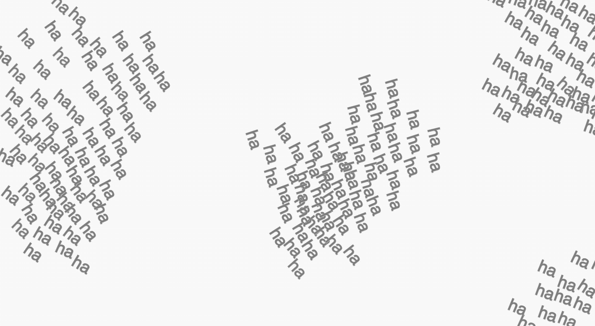

# Chat Woids

Originally posted on December 11, 2018, for Computational Typography @ NYU ITP Fall 2018

Welcome to Chat Woids, a chat room that embodies the flow of conversation quite literally.

For this final assignment I created an opportunity to consider computational typography in the context of multi-user interaction. Building off of my recent flocking sketch with the ha has, I incorporated a socket server to receive input from any number of connected clients. Text messages spawn at the center of the screen and then move around according to algorithmic rules modeled on animal behavior (as first laid out by Craig Reynolds [here](https://www.red3d.com/cwr/boids/) and later programmed by Daniel Shiffman as seen [here](https://www.youtube.com/watch?v=mhjuuHl6qHM&feature=youtu.be)).

Visualizing words as flocking/herding/schooling together matches my mental model of what happens when spoken words leave our lips: they stay with us and with each other in some capacity to inform the context of the present moment and our word choices. Over time, perhaps their initial weights diminish and they linger on the periphery.

I spent some time learning the computation of flocking behavior. The material agents, whether they be the original boids or my current woids, follow three rules: cohesion (find your neighbors within a given radius), separation (but don’t run into them), and alignment (move in the same direction as them). Playing with the global weights of each of these impacted how the woids in my chat room behaved. Too much separation and the woids avoided each other at all costs. Too much cohesion and they clustered together into a tight wad that greatly reduced legibility. In the end I adjusted the parameters to ensure balanced flocking tendencies. Isn’t it nice to picture a flowy trail of words emanating from a friendly chat?

The chat room was well-received during some brief playtesting on the floor. My guests enjoyed the disruption to the normal text/chat space, especially seeing prior words swing back into view. A useful suggestion was to incorporate some visual modification to the text to indicate when words entered into the stream. Otherwise it became increasingly (or even more) challenging to read and respond. I decided to reduce the font size of the woids over time to give priority to newer additions to the conversation and also to mirror my image of how they distance themselves yet continue to hover around conversation-goers.

My understanding is the this flocking code only accounts for acceleration and force (they equal each other here) but not the mass of the woids. I’d play with this in future iterations (and learn physics again!), perhaps assigning a mass to each agent according to the character count of the submitted strings. In addition, I’d play with assigning chat room users different weights for separation, alignment, cohesion, as well as their own parameters for acceleration and velocity. I’m curious how it would impact the conversation dynamics if some texts stayed aloof or others lagged behind.

More than anything, I love this idea that our words stay nearby but take on a life of their own after they leave us.

While the room is still deployed, [chat here](http://emn200.itp.io:8000/)!

[Code](https://github.com/ellennickles/chat-woids)
